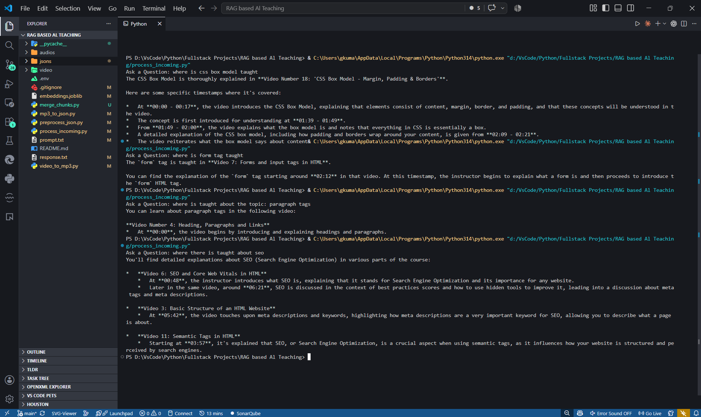
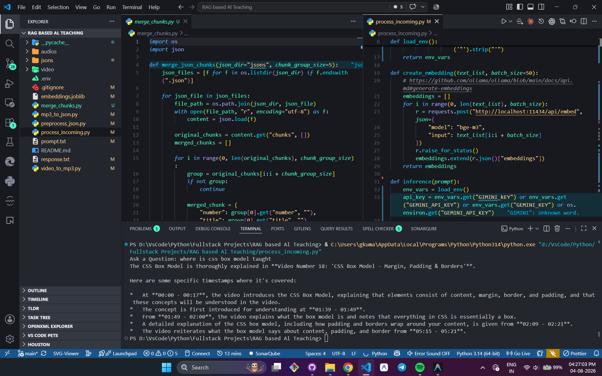

<div align="center">

  <h1>🎓 RAG-Based AI Teaching Assistant</h1>
  <p><strong>Transform Full-Length Course Videos into an Interactive, Timestamp-Aware AI Tutor</strong></p>

  [](https://python.org)
  [](https://ai.google.dev/)
  [](https://ollama.ai)
  [](https://github.com/openai/whisper)
  [](https://ffmpeg.org)
  [](https://scikit-learn.org)

</div>

---

## 📌 Overview

**RAG-Based AI Teaching Assistant** is a high-performance, Retrieval-Augmented Generation (RAG) system built specifically for video course lecture processing. It turns long video lectures into an intelligent, queryable AI knowledge base.

Students can ask natural language questions about any course topic and instantly receive **grounded explanations** complete with **exact video numbers, titles, and precise timestamps (`MM:SS`)**.

---

## 📸 Demonstration & Screenshots

<div align="center">

### 💡 Interactive RAG Terminal Querying
*Demonstrating accurate video title resolution and exact timestamp (`MM:SS`) extraction for student queries:*



<br/>

### ⚙️ Chunk Merging & RAG Pipeline Execution
*Side-by-side look at `merge_chunks.py` chunking optimization and `process_incoming.py` execution:*



</div>

---

## ✨ Key Features

- 🎥 **Automated Audio Pipeline**: Extracts MP3 audio from `.webm`/`.mp4` course videos using `ffmpeg`.
- 🎙️ **Speech-to-Text Transcription**: Uses **OpenAI Whisper (Large-v2)** to translate & transcribe course audio into timestamped subtitle chunks.
- 🧩 **Smart 5-Chunk Merging**: Merges 5 small ~10-word transcript segments into 1 rich context chunk (~50 words), dramatically boosting vector retrieval accuracy.
- 🧠 **Dense Multilingual Vector Embeddings**: Uses Ollama's **`bge-m3`** model to generate high-dimensional vector embeddings stored in `embeddings.joblib`.
- ⚡ **Lightning-Fast Similarity Search**: Employs `scikit-learn` Cosine Similarity to find top matching lecture chunks in milliseconds.
- 🤖 **Context-Grounded LLM Answers**: Integrates **Google Gemini 2.5 Flash API** to deliver polite, structured, timestamped answers directly to the student.

---

## 🏗️ System Architecture & Execution Flow

```mermaid
flowchart TD
    subgraph Phase1 ["1️⃣ Video & Audio Ingestion"]
        A["📹 Course Videos (.mp4 / .webm)"] -->|video_to_mp3.py / FFmpeg| B["🎵 Audio Files (.mp3)"]
    end

    subgraph Phase2 ["2️⃣ Transcription & Chunk Merging"]
        B -->|mp3_to_json.py / Whisper Large-v2| C["📜 Raw Transcript JSONs (~10 words/chunk)"]
        C -->|merge_chunks.py / 5-in-1 Aggregator| D["🧩 Context-Rich JSONs (~50 words/chunk)"]
    end

    subgraph Phase3 ["3️⃣ Vector Embedding Store"]
        D -->|preprocess_json.py / Ollama BGE-M3| E["🧠 Vector Embeddings Matrix"]
        E -->|joblib| F["💾 embeddings.joblib"]
    end

    subgraph Phase4 ["4️⃣ RAG Search & Gemini AI Inference"]
        G["🙋 Student Question"] -->|process_incoming.py| H["⚡ Question Vector"]
        H & F -->|Cosine Similarity| I["🎯 Top 5 Context Chunks"]
        I -->|Gemini 2.5 Flash API (.env key)| J["💡 Answer + Exact Video Title & MM:SS Timestamp"]
    end

    style Phase1 fill:#1e1e2e,stroke:#89b4fa,stroke-width:2px,color:#cdd6f4
    style Phase2 fill:#181825,stroke:#f9e2af,stroke-width:2px,color:#cdd6f4
    style Phase3 fill:#1e1e2e,stroke:#a6e3a1,stroke-width:2px,color:#cdd6f4
    style Phase4 fill:#181825,stroke:#cba6f7,stroke-width:2px,color:#cdd6f4
```

---

## 🛠️ Tech Stack & Dependencies

| Component | Technology | Role |
| :--- | :--- | :--- |
| **Language** | Python 3.10+ | Core pipeline orchestration |
| **Audio Processing** | FFmpeg | Video to MP3 conversion |
| **Transcription** | OpenAI Whisper (Large-v2) | Speech-to-text translation & timestamping |
| **Chunking Logic** | Custom Python (`merge_chunks.py`) | Merges 5 small chunks to optimize RAG context windows |
| **Embeddings** | BGE-M3 (via Ollama API) | 1024-dim dense semantic vector embeddings |
| **Vector Storage** | Joblib & Pandas | Local serialization of embeddings dataframe |
| **Similarity Metric** | Cosine Similarity (`scikit-learn`) | RAG candidate retrieval |
| **LLM Inference** | Google Gemini 2.5 Flash | Fast reasoning & response generation using `.env` key |

---

## 📁 Repository Structure

```text
.
├── videos/             # Raw input course videos (.webm / .mp4)
├── audios/             # Extracted audio files (.mp3)
├── jsons/              # Generated timestamped transcript JSONs
├── ss/                 # Demonstration screenshots (p1.png, p2.png)
├── video_to_mp3.py     # Script 1: Converts video files to MP3 audio
├── mp3_to_json.py      # Script 2: Runs Whisper Large-v2 to produce raw JSON chunks
├── merge_chunks.py     # Script 3: Merges 5 small transcript chunks into 1 rich chunk
├── preprocess_json.py  # Script 4: Generates BGE-M3 vector embeddings dataframe
├── process_incoming.py # Script 5: RAG engine - query embedding, vector search & Gemini API response
├── prompt.txt          # Auto-generated prompt submitted to Gemini API
├── response.txt        # Last generated response from Gemini API
├── .env                # API Keys file (GIMINI_kEY=...)
└── README.md           # Documentation
```

---

## 🚀 Step-by-Step Setup & Usage Guide

### 1. Prerequisites

Ensure you have installed:
- **Python 3.10+**
- **FFmpeg** (added to System PATH)
- **Ollama** ([Download Ollama](https://ollama.ai))

### 2. Environment Configuration (`.env`)

Create a `.env` file in the root directory and add your Google Gemini API Key:

```env
GIMINI_kEY=your_gemini_api_key_here
```

### 3. Pull Required Embedding Model

Ensure Ollama is running (`ollama serve`), then pull `bge-m3`:

```bash
ollama pull bge-m3
```

### 4. Install Dependencies

```bash
pip install pandas numpy scikit-learn joblib requests openai-whisper
```

---

## ⚡ Execution Pipeline Flow

### Step 1: Video to Audio Conversion
Place course videos into `videos/` folder and run:
```bash
python video_to_mp3.py
```

### Step 2: Transcribe Audio to JSON
Convert audio files to timestamped transcript JSONs using Whisper:
```bash
python mp3_to_json.py
```

### Step 3: Merge Small Transcript Chunks
Combine 5 consecutive small chunks into 1 context-rich segment (~50 words):
```bash
python merge_chunks.py
```

### Step 4: Generate Embeddings
Generate `bge-m3` vector embeddings for all merged chunks:
```bash
python preprocess_json.py
```
*Outputs `embeddings.joblib`.*

### Step 5: Ask Questions (RAG Query)
Run the interactive RAG query script:
```bash
python process_incoming.py
```

---

## 🎯 Example Query & Response

**Student Question:**
```text
Ask a Question: where is css box model taught
```

**AI Tutor Output:**
```text
The CSS Box Model is thoroughly explained in Video Number 18: 'CSS Box Model - Margin, Padding & Borders'.

Here are some specific timestamps where it's covered:

* At 00:00 - 00:17, the video introduces the CSS Box Model, explaining that elements consist of content, margin, border, and padding.
* From 01:49 - 02:00, the video explains what the box model is and notes that everything in CSS is essentially a box.
* A detailed explanation of the CSS box model, including how padding and borders wrap around your content, is given from 02:09 - 02:21.
```

---

## 📜 License

Distributed under the MIT License.
