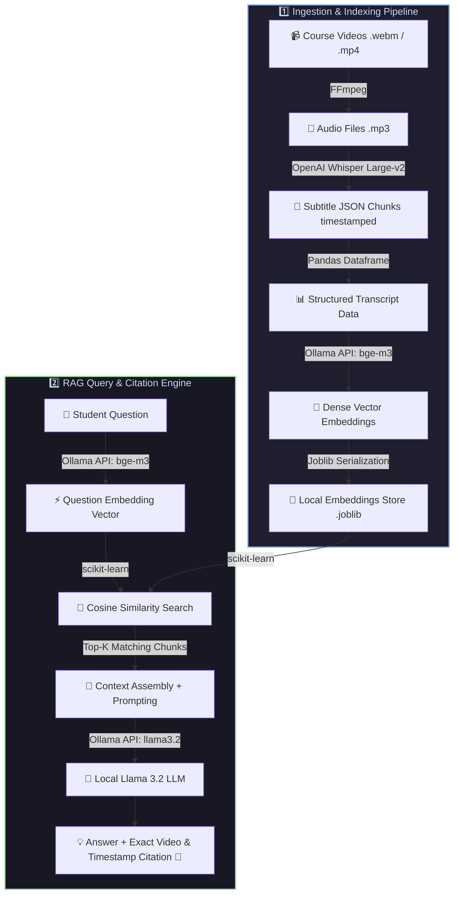

<div align="center">

  <h1>🎓 Local RAG-Based AI Teaching Assistant</h1>
  <p><strong>Transform Course Videos into an Interactive, Timestamp-Aware AI Tutor — 100% Offline & Private</strong></p>

  [](https://python.org)
  [](https://ollama.ai)
  [](https://github.com/openai/whisper)
  [](https://ffmpeg.org)
  [](https://scikit-learn.org)
  [](https://pandas.pydata.org)
  [](https://numpy.org)

</div>

---

## 📌 Overview

**RAG-based AI Teaching Assistant** is an end-to-end local Retrieval-Augmented Generation (RAG) system designed for video course processing. It enables students to ask questions about course content and get precise, contextual answers complete with **exact video references and timestamps**.

The entire pipeline runs **locally on your machine** — ensuring total privacy, no third-party API costs, and full offline usability.

---

## ✨ Key Features

- 🎥 **Automated Audio Extraction**: Extracts MP3 audio from `.webm`, `.mp4`, or `.mkv` course videos using FFmpeg.
- 🎙️ **High-Precision Transcription**: Uses **OpenAI Whisper Large-v2** to translate and transcribe video speech into structured, timestamped JSON chunks.
- 🧠 **Dense Semantic Embeddings**: Leverages the **`bge-m3`** model (via Ollama API) to map transcript chunks into high-dimensional vector space.
- 🔍 **Vector Retrieval**: Computes **Cosine Similarity** (scikit-learn & NumPy) to instantly discover the most relevant video segments for any question.
- 💬 **Grounded LLM Answers**: Queries **Llama 3.2** (via Ollama) to synthesize natural, accurate answers that explicitly cite the **exact video name and timestamp (MM:SS)**.
- 🔒 **100% Local & Private**: No cloud calls, no data tracking, and zero API subscriptions required.

---

## 🏗️ System Architecture & Workflow



---

## 🛠️ Tech Stack & Technologies

| Layer / Role | Tool / Technology | Description |
| :--- | :--- | :--- |
| **Pipeline Core** |  **Python 3.10+** | Powers the processing, vector search, and RAG orchestration |
| **Media Processing** |  **FFmpeg** | Command-line utility for converting multi-format video files to MP3 |
| **Speech-to-Text** |  **OpenAI Whisper (Large-v2)** | SOTA model for accurate speech transcription & translation |
| **Embedding Engine** |  **BGE-M3 (via Ollama)** | High-performing multilingual vector embedding model |
| **LLM Inference** |  **Llama 3.2 (via Ollama)** | Lightweight local LLM for fast, accurate context-grounded reasoning |
| **Local LLM Server** |  **Ollama Local API** | Serves local models at `http://localhost:11434` |
| **Vector Math & Search** |  **scikit-learn & NumPy** | Computes cosine similarity between question and transcript vectors |
| **Data & Serialization** |  **Pandas & Joblib** | Organizes transcript chunks and serializes embedding datasets |
| **Data Format** |  **JSON** | Stores chunked transcripts with start/end timestamps |
| **HTTP Client** |  **Requests** | Communicates with the local Ollama REST endpoint |

---

## 📁 Repository Structure

```text
.
├── video/                      # Input directory containing raw course videos (.webm / .mp4)
├── audio/                      # Converted MP3 audio files generated by FFmpeg
├── process_video.py            # Converts raw videos into formatted MP3 audio
├── transcribe_audio.py         # Runs Whisper Large-v2 to output timestamped JSON chunks
├── generate_embeddings.py      # Creates & saves BGE-M3 embeddings dataframe using joblib
├── query_rag.py                # Main RAG search engine & Ollama Llama 3.2 response generator
└── README.md                   # Project documentation
```

---

## 🚀 Getting Started

### 1. Prerequisites

Make sure you have the following installed on your machine:

- **Python 3.10+**: [Download Python](https://www.python.org/downloads/)
- **FFmpeg**: Must be installed and available in system `PATH`.
  - *Windows*: `winget install FFmpeg` or `choco install ffmpeg`
  - *Linux*: `sudo apt install ffmpeg`
  - *macOS*: `brew install ffmpeg`
- **Ollama**: [Download Ollama](https://ollama.ai/)

### 2. Pull Required Ollama Models

Start the Ollama server, then pull the embedding and LLM models:

```bash
# Pull BGE-M3 embedding model
ollama pull bge-m3

# Pull Llama 3.2 LLM for answer generation
ollama pull llama3.2
```

### 3. Install Python Dependencies

```bash
pip install pandas numpy scikit-learn joblib requests openai-whisper
```

---

## 💻 Usage Guide

### Step 1: Video to Audio Conversion
Place your course video files into the `video/` directory and run:

```bash
python process_video.py
```
*Outputs clean MP3 files into `audio/` with normalized tutorial numbers and titles.*

### Step 2: Transcribe & Chunk Audio
Run Whisper transcription to extract subtitle-like JSON chunks:

```bash
python transcribe_audio.py
```
*Generates JSON files containing start/end timestamps and text segments for each video.*

### Step 3: Generate & Save Embeddings
Build the vector embeddings matrix using `bge-m3` via Ollama:

```bash
python generate_embeddings.py
```
*Saves the dataframe and embeddings locally using `joblib`.*

### Step 4: Ask Questions (RAG Query)
Execute the RAG query engine to interact with your video course library:

```bash
python query_rag.py
```

---

## 🎯 Example Output

**Student Question:**
> *"What are Core Web Vitals and why are they important for SEO?"*

**RAG System Response:**
> **Core Web Vitals** are a set of metrics defined by Google to measure user experience on web pages, focusing on loading performance, interactivity, and visual stability. They directly impact search engine ranking.
>
> 📍 **Watch Tutorial Reference:**
> - **Video:** `SEO and Core Web Vitals in HTML ｜ Sigma Web Development Course`
> - **Timestamp:** `04:15 - 05:42`

---

## 🤝 Contributing

Contributions, feedback, and feature suggestions are welcome! Feel free to open an Issue or submit a Pull Request.

---

## 📜 License

Distributed under the MIT License. See `LICENSE` for more information.
